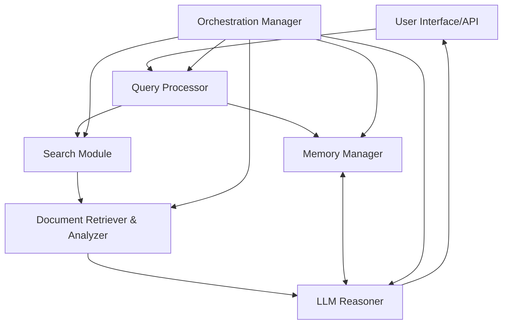
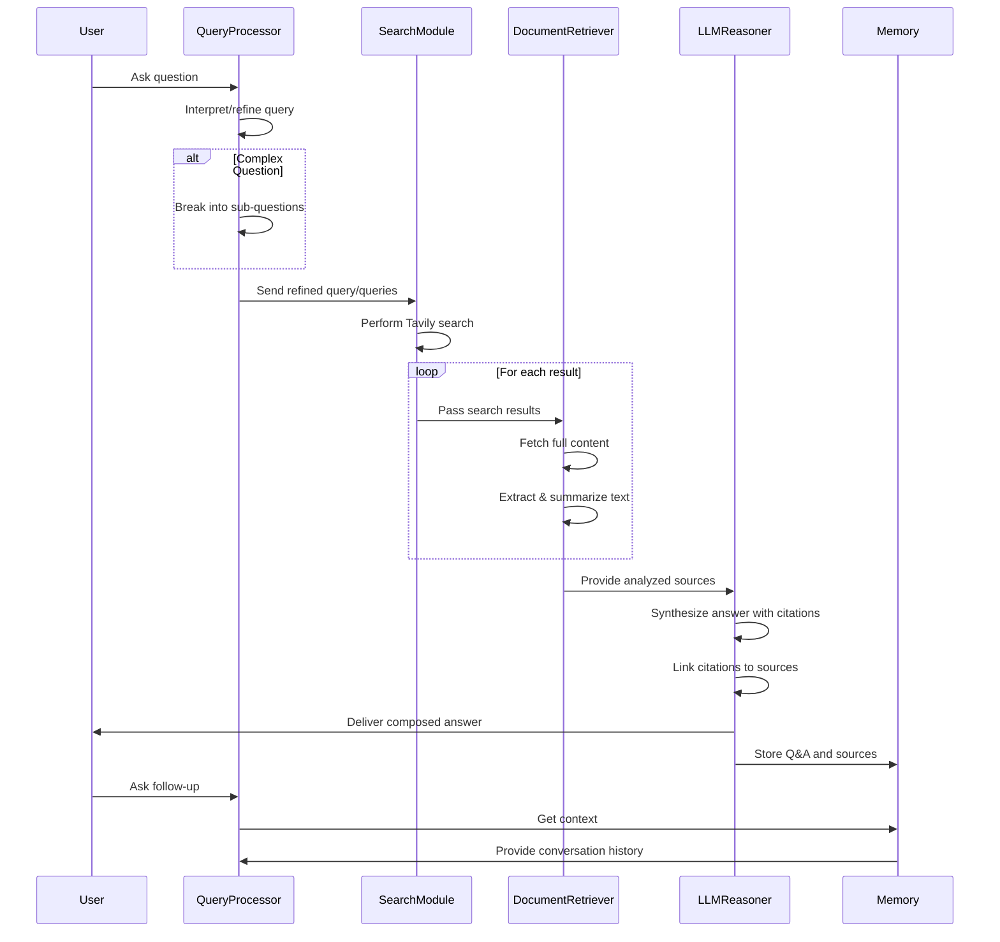

# Deep Research Assistant: Product Requirements Document

## 1. Introduction

### 1.1 Purpose

The Deep Research Assistant (DRA) is an advanced AI-powered tool designed to conduct thorough research in response to user queries. Unlike traditional search engines that return a list of links, DRA actively searches for information, analyzes sources, synthesizes findings, and presents well-cited, coherent answers in a conversational format.

### 1.2 Product Vision

To create a conversational AI assistant that performs comprehensive research on any topic, delivering factual, well-cited, and coherent answers while maintaining context across multiple conversation turns. The system will pull information from diverse, authoritative sources and present synthesized findings that directly address user queries.

### 1.3 Target Users

- Researchers seeking efficient information gathering
- Students working on academic assignments
- Knowledge workers needing factual information with citations
- Journalists researching for articles
- General users seeking in-depth information on any topic

### 1.4 Core Value Proposition

DRA drastically reduces the time and effort needed to conduct comprehensive research by:
- Automatically searching and analyzing multiple sources
- Ensuring factual accuracy with proper citations
- Maintaining conversation context to support follow-up questions
- Delivering clear, synthesized answers rather than a list of links
- Balancing different perspectives on complex topics

## 2. System Architecture

### 2.1 High-Level Architecture

### 2.2 Core Components and Relationships

#### 2.2.1 User Interface / API
Accepts the user's query in natural language and displays the assistant's response. Supports conversation history viewing and follow-up questions.

#### 2.2.2 Query Processor (Interpreter)
Interprets the user's question, potentially reformulating or breaking it into sub-queries for better search coverage. Uses LLM to understand complex queries, especially multi-part or ambiguous ones.

#### 2.2.3 Search Module
Handles web searches using Tavily's Search API as the primary tool, optimized for LLM agents. May incorporate alternative search services as fallbacks or for specialized domains.

#### 2.2.4 Document Retriever & Analyzer
Fetches content from search results (web pages or documents) and analyzes them. This includes scraping text, summarizing content, and extracting key facts from each source.

#### 2.2.5 LLM Reasoner (Answer Synthesizer)
Core AI (using LangChain/LangGraph with an LLM) that takes the processed query and relevant source information to generate a synthesized answer. Produces output with citations to avoid hallucinations.

#### 2.2.6 Memory/Storage
Maintains state including conversation history, previously found sources, and intermediate results. Uses Deno KV or SQLite for persistence.

#### 2.2.7 Orchestration Manager
Coordinates the flow between components. This LangChain agent or LangGraph workflow decides when to search, when to read from memory, and when to invoke the LLM.

### 2.3 Data Flow

### 2.4 Integration Points with External Services

#### 2.4.1 Web Search (Tavily)
Primary web search API, providing LLM-optimized search with relevant results and content snippets. Configuration includes:
- API key management
- Usage quota monitoring
- Advanced search features (search_depth="advanced", include_raw_content=true)
- Fallback search services if needed (e.g., SerpAPI, Google Custom Search, Bing)

#### 2.4.2 Content Fetching
For accessing web pages, potentially bypassing anti-scraping measures:
- Deno's secure runtime with network permission
- HTML parsing with Cheerio or Deno HTML parser
- Rate limiting and error handling for reliability

#### 2.4.3 LLM API
For query understanding and answer synthesis:
- Integration with OpenAI's GPT-4 or equivalent model
- API key and token usage management
- Multiple calls per query as needed
- Error handling and retries

#### 2.4.4 Database/Storage
For persistence across sessions:
- Deno KV (built-in key-value store) or SQLite
- Session-based conversation storage
- Cache for retrieved pages and summaries

#### 2.4.5 Additional Services (Optional Extensions)
- Vector database (e.g., Pinecone) for custom document corpus
- LangSmith for logging and debugging agent steps
- Specialized data sources for specific domains

## 3. Key Features

### 3.1 Source Retrieval and Analysis

#### 3.1.1 Web Search Integration
**Requirements:**
- Integrate Tavily Search API as primary search engine
- Configure search parameters (depth, result count, etc.)
- Return structured results (title, URL, snippet, confidence score)
- Set up error handling and fallbacks

**Acceptance Criteria:**
- Successfully retrieve relevant results for test queries
- Results include metadata needed for further processing
- System handles API failures gracefully

#### 3.1.2 Advanced Search Queries
**Requirements:**
- Generate multiple search queries for complex questions
- Create focused sub-queries for different aspects of a topic
- Optimize query terms for better search results

**Acceptance Criteria:**
- Complex questions generate appropriate sub-queries
- Sub-queries cover all relevant aspects of the original question
- Each sub-query returns relevant results

#### 3.1.3 Diverse Sources
**Requirements:**
- Retrieve information from varied sources (news, academic, government)
- Implement strategies to avoid single-source dominance
- Use domain-specific searches when appropriate

**Acceptance Criteria:**
- Search results include multiple domains for broad topics
- System can prioritize authoritative sources when appropriate
- Results avoid echo-chamber effects

#### 3.1.4 Content Analysis & Filtering
**Requirements:**
- Analyze source content for relevance and quality
- Rank sources by authority and relevance
- Identify and note conflicting information across sources

**Acceptance Criteria:**
- Low-quality or irrelevant sources are filtered out
- Sources are correctly ranked by authority
- Conflicting information is properly identified

#### 3.1.5 Summarization of Sources
**Requirements:**
- Generate concise summaries of retrieved documents
- Focus summaries on query-relevant information
- Maintain citation links to original sources

**Acceptance Criteria:**
- Summaries accurately capture key information
- Summaries focus on query-relevant aspects
- Original source information is preserved

### 3.2 Citation and Reference Management

#### 3.2.1 Tracking Sources for Each Fact
**Requirements:**
- Tag snippets of text with source information
- Maintain mapping between facts and sources
- Ensure all factual claims can be traced back to sources

**Acceptance Criteria:**
- Each factual claim is linked to its source
- Source tracking persists through the research process
- Fact-source mapping is accurate

#### 3.2.2 Structured Citation Format
**Requirements:**
- Define schema for structured output with citations
- Implement validation of citation structure
- Handle validation failures with retries or corrections

**Acceptance Criteria:**
- Output consistently follows defined citation schema
- Schema validation catches formatting errors
- Correction mechanisms resolve formatting issues

#### 3.2.3 In-Text Citation Placement
**Requirements:**
- Format citations as footnotes or inline brackets
- Maintain consistent citation formatting
- Provide reference details on demand

**Acceptance Criteria:**
- Citations are consistently formatted throughout responses
- Citations are clearly linked to supporting statements
- Full reference details are available when needed

#### 3.2.4 Citation Accuracy Check
**Requirements:**
- Verify that citations actually support the claims
- Compare answer claims against source text
- Implement correction for mismatched citations

**Acceptance Criteria:**
- Cited sources actually support the claims made
- Verification process catches citation errors
- Corrections are made when discrepancies are found

#### 3.2.5 Reference Database
**Requirements:**
- Maintain a session bibliography of sources
- Store source metadata (URL, title, author, date)
- Support deduplication of sources

**Acceptance Criteria:**
- Bibliography contains all sources used
- Source metadata is accurate and complete
- Duplicate sources are properly merged

### 3.3 Query Understanding and Refinement

#### 3.3.1 Natural Language Parsing
**Requirements:**
- Parse queries to identify main topics and subtopics
- Determine the type of information requested
- Handle complex or multi-part questions

**Acceptance Criteria:**
- System correctly identifies all parts of complex queries
- Information type is correctly determined
- Multi-part questions are properly decomposed

#### 3.3.2 Dynamic Query Refinement
**Requirements:**
- Reformulate ambiguous or broad queries
- Generate precise search terms from natural language questions
- Break down broad topics into manageable chunks

**Acceptance Criteria:**
- Ambiguous queries are clarified before searching
- Generated search terms improve search relevance
- Broad topics are properly scoped

#### 3.3.3 Asking Clarifying Questions
**Requirements:**
- Identify when queries are too unclear or ambiguous
- Generate relevant clarifying questions
- Incorporate user clarifications into search strategy

**Acceptance Criteria:**
- System recognizes when clarification is needed
- Clarifying questions are relevant and helpful
- User clarifications properly guide the search

#### 3.3.4 Breaking Down Complex Tasks
**Requirements:**
- Implement planner-executor pattern for complex queries
- Create research outlines for broad topics
- Handle each sub-task appropriately

**Acceptance Criteria:**
- Complex tasks are broken into logical sub-tasks
- Sub-tasks collectively address the original query
- Sub-task handling leads to comprehensive answers

#### 3.3.5 Intent Understanding and Context Use
**Requirements:**
- Maintain conversation context for follow-up questions
- Resolve ambiguous referents in questions
- Connect new questions to previous conversation

**Acceptance Criteria:**
- Follow-up questions are correctly contextualized
- Ambiguous terms are resolved using context
- Conversation feels natural and coherent

### 3.4 Result Synthesis and Presentation

#### 3.4.1 Comprehensive Synthesis
**Requirements:**
- Combine information from multiple sources coherently
- Integrate related or connected facts
- Generate narrative flow in answers

**Acceptance Criteria:**
- Answers integrate information from all relevant sources
- Related information is logically grouped
- Narrative is fluid and well-structured

#### 3.4.2 Maintaining Coherence
**Requirements:**
- Create logical flow in answers
- Include introductions and conclusions
- Keep answers focused on the question

**Acceptance Criteria:**
- Answers have clear structure and flow
- Introductions and conclusions frame the response
- Content stays relevant to the query

#### 3.4.3 Conversational Tone with Academic Rigor
**Requirements:**
- Balance friendly tone with informative content
- Incorporate citations naturally in text
- Adapt tone based on question complexity

**Acceptance Criteria:**
- Responses are approachable yet authoritative
- Citations are integrated smoothly in text
- Tone matches the query's complexity and domain

#### 3.4.4 Citing Sources in the Answer
**Requirements:**
- Include citation markers for factual claims
- Provide source details when requested
- Support citation verification

**Acceptance Criteria:**
- Each major claim has an appropriate citation
- Source details are available on request
- Citations can be verified against sources

#### 3.4.5 Handling Uncertainty
**Requirements:**
- Acknowledge when sources disagree
- Indicate when information is incomplete
- Avoid speculation when evidence is lacking

**Acceptance Criteria:**
- Disagreements between sources are clearly noted
- System acknowledges information gaps
- Speculation is avoided when evidence is insufficient

#### 3.4.6 Multi-Turn Delivery
**Requirements:**
- Support breaking down large answers into chunks
- Offer detailed or summary options for complex topics
- Handle follow-up questions on specific aspects

**Acceptance Criteria:**
- Large answers can be delivered in manageable parts
- Users can choose detail level when appropriate
- Follow-up questions on specific points are handled correctly

## 4. Implementation Approach

### 4.1 Development Phases

#### 4.1.1 Phase 1: Project Setup
**Tasks:**
- Set up Deno project and Git repository
- Install dependencies (LangChain/LangGraph, Zod, etc.)
- Configure Tavily API integration
- Initialize storage (Deno KV or SQLite)
- Define basic data structures and interfaces

**Deliverables:**
- Working development environment
- Basic project structure
- Configuration for external APIs
- Data schema definitions

#### 4.1.2 Phase 2: Basic Search & Retrieval
**Tasks:**
- Implement Tavily search function
- Create content fetching and extraction
- Build basic document summarization
- Test the pipeline with simple queries

**Deliverables:**
- Working search module
- Content retrieval functionality
- Basic document analyzer
- End-to-end test for simple queries

#### 4.1.3 Phase 3: Multi-Source Retrieval
**Tasks:**
- Extend to handle multiple search results
- Implement source ranking and filtering
- Add duplicate detection for similar sources
- Test with broader questions

**Deliverables:**
- Multi-source retrieval capability
- Source quality assessment
- Duplicate detection system
- Test results for broader questions

#### 4.1.4 Phase 4: LLM Answer Composition
**Tasks:**
- Create prompt templates for answer synthesis
- Implement citation integration in answers
- Build source mapping and verification
- Test answer quality and accuracy

**Deliverables:**
- Answer synthesis module
- Citation system
- Source verification mechanism
- Quality assessment results

#### 4.1.5 Phase 5: Conversational Capability
**Tasks:**
- Implement conversation history storage
- Build context handling for follow-ups
- Create mechanisms for conversation continuity
- Test multi-turn conversations

**Deliverables:**
- Conversation history system
- Context-aware query handling
- Multi-turn conversation support
- Conversation flow test results

#### 4.1.6 Phase 6: Refinement and Advanced Features
**Tasks:**
- Optimize for performance and latency
- Improve error handling and fallbacks
- Enhance citation accuracy
- Implement query refinement for complex questions
- Add advanced features (clarification, etc.)

**Deliverables:**
- Performance metrics and improvements
- Robust error handling
- Enhanced citation system
- Query refinement mechanism
- Advanced features implementation

### 4.2 Critical Technical Decisions

#### 4.2.1 LangChain vs. Custom Orchestration
**Decision Point:** Whether to rely on LangChain/LangGraph for orchestration or build custom logic.

**Recommendation:**
Use a hybrid approach:
- LangChain for straightforward sequences (search → summarize → answer)
- LangGraph for complex flows (planning, parallel execution, etc.)
- Custom TypeScript logic for specific needs (caching, fallbacks)

**Rationale:**
- LangChain provides ready-made tools and abstractions
- LangGraph excels at managing complex agent workflows
- Custom code offers more control for bespoke requirements

#### 4.2.2 Choice of LLM and Token Management
**Decision Point:** Which LLM to use and how to manage context limitations.

**Recommendation:**
- Primary: OpenAI's GPT-4 for critical tasks (final answer synthesis)
- Secondary: GPT-3.5 for intermediate tasks (summarization, query refinement)
- Fallback: Consider open models for cost optimization
- Context Management: Split large context into multiple LLM calls if needed

**Rationale:**
- GPT-4 provides highest accuracy but at higher cost
- GPT-3.5 balances speed and cost for less critical tasks
- Multiple calls can overcome context limitations
- Strategic token usage controls costs

#### 4.2.3 Retrieval Latency Management
**Decision Point:** How to balance thoroughness vs. speed in research.

**Recommendation:**
- Cap result count (5-7 sources for most queries)
- Implement concurrent fetching for parallel processing
- Set timeouts for overall research process (15 seconds target)
- Consider preliminary/streaming answers for long queries

**Rationale:**
- Users expect responses within reasonable time (under 15 seconds)
- Parallelization reduces wait time
- Preliminary answers maintain engagement during longer searches
- User experience degrades significantly with longer waits

#### 4.2.4 Citation Accuracy Approach
**Decision Point:** How to ensure citations actually support claims.

**Recommendation:**
- Instruct LLM to include short quotes in citations
- Implement source-claim verification for critical applications
- Use structured output formats to enforce citation inclusion
- Set low LLM temperature to reduce creativity

**Rationale:**
- Quotes provide direct evidence from sources
- Verification catches misattributed claims
- Structured output ensures consistent formatting
- Lower temperature reduces hallucination risk

#### 4.2.5 Hallucination Prevention Methods
**Decision Point:** Strategies to minimize hallucinations.

**Recommendation:**
- Strict reliance on retrieved content only
- Low temperature setting for LLMs
- Explicit instructions against unsourced claims
- Optional verification step for critical applications

**Rationale:**
- Retrieval-augmentation is primary defense
- Low temperature reduces creativity/invention
- Clear instructions guide model behavior
- Verification provides additional safeguard

#### 4.2.6 Long Session Management
**Decision Point:** How to handle conversation history without exceeding context limits.

**Recommendation:**
- Implement rolling summarization of conversation
- Summarize every 5-7 turns to compress history
- Prioritize recent turns over older ones
- Store full history but use compressed context

**Rationale:**
- Summarization balances context preservation and token efficiency
- Recent history is typically more relevant
- Complete history remains available if needed
- Prevents context window overflow

#### 4.2.7 Schema Validation with Zod
**Decision Point:** When and how to use Zod for validation.

**Recommendation:**
- Use Zod for all external API responses
- Apply it to LLM structured outputs
- Implement retry logic for validation failures
- Set maximum retry attempts (3) before fallback

**Rationale:**
- Validation catches format errors early
- Retries can resolve temporary issues
- Fallbacks prevent infinite loops
- Improves overall system robustness

### 4.3 Potential Challenges and Solutions

#### 4.3.1 Hallucinations and Misinformation
**Challenge:** LLM might generate information not supported by sources.

**Solutions:**
- Strict retrieval augmentation (never answer without sources)
- Verification steps for each generated claim
- Track hallucination rate as a key metric
- Focus generation on only facts from sources

#### 4.3.2 Ambiguous or Broad Queries
**Challenge:** Users may ask extremely broad questions that are difficult to scope.

**Solutions:**
- Implement clarification mechanism for overly broad queries
- Set reasonable limits on research depth (3-5 subquestions)
- Provide high-level summaries with offers to explore subtopics
- Guide users toward more specific questions

#### 4.3.3 Managing Depth vs. Speed
**Challenge:** Trade-off between thorough research and quick responses.

**Solutions:**
- Implement adaptive depth based on query complexity
- Provide preliminary answers for complex questions
- Set time budgets for research phases
- Use parallel processing where possible

#### 4.3.4 Tool Reliability and Maintenance
**Challenge:** External services like Tavily may have downtime or API changes.

**Solutions:**
- Implement backup search methods
- Monitor API responses for unexpected changes
- Use Zod to validate API responses against schema
- Log unusual patterns for investigation

#### 4.3.5 Cost Management
**Challenge:** API calls to search and LLM services incur costs.

**Solutions:**
- Limit context length and number of sources
- Use cheaper models for intermediate steps
- Implement caching for common queries
- Monitor and optimize token usage

#### 4.3.6 Multi-language Support
**Challenge:** Users may ask questions in non-English languages.

**Solutions:**
- Detect query language
- Translate non-English queries for searching
- Translate answers back to original language
- Note translation in response for transparency

## 5. Evaluation Metrics

### 5.1 Research Quality Metrics

#### 5.1.1 Source Diversity
**Description:** Measures the variety of sources used in answers.
**Measurement:** Count of unique domains/authors in citations.
**Target:** At least 3 distinct sources for complex topics.

#### 5.1.2 Source Authority
**Description:** Assesses the credibility of sources used.
**Measurement:** Percentage of high-authority sources in citations.
**Target:** >70% high-authority sources when available.

#### 5.1.3 Information Depth
**Description:** Evaluates how detailed and thorough the information is.
**Measurement:** Count of distinct relevant points made; presence of specific data.
**Target:** All major aspects of the query addressed with specific details.

#### 5.1.4 Temporal Relevance
**Description:** Checks if sources are up-to-date relative to the query.
**Measurement:** Average publication date of sources vs. query context.
**Target:** Sources not older than 1 year for current events; seminal sources allowed for historical topics.

#### 5.1.5 Citation Accuracy
**Description:** Verifies citations actually support the claims they're attached to.
**Measurement:** Percentage of citations that correctly support their claims.
**Target:** >95% accuracy rate for citations.

### 5.2 Response Effectiveness Metrics

#### 5.2.1 Query Understanding Rate
**Description:** Measures how often the assistant correctly interprets user intent.
**Measurement:** Percentage of queries correctly understood without clarification.
**Target:** >90% correct interpretation on first attempt.

#### 5.2.2 Synthesis Quality
**Description:** Evaluates coherence and clarity of answers.
**Measurement:** Rubric-based scoring of answer structure and readability.
**Target:** Average score >4 on 5-point scale.

#### 5.2.3 Claim Substantiation
**Description:** Checks if factual claims are backed by citations.
**Measurement:** Ratio of citations to factual claims made.
**Target:** >90% of non-trivial claims substantiated.

#### 5.2.4 Perspective Balance
**Description:** Assesses whether multiple viewpoints are presented when appropriate.
**Measurement:** Presence of multiple perspectives on subjective topics.
**Target:** All appropriate topics present >1 perspective.

#### 5.2.5 Response Completeness
**Description:** Evaluates if all parts of the question are addressed.
**Measurement:** Percentage of query components addressed in the answer.
**Target:** >95% completeness rate.

### 5.3 Technical Performance Metrics

#### 5.3.1 Research Latency
**Description:** Time from query to answer delivery.
**Measurement:** End-to-end latency in seconds.
**Target:** <10s for simple queries, <20s for complex ones.

#### 5.3.2 Retrieval Precision/Recall
**Description:** Relevance and coverage of retrieved sources.
**Measurement:** Percentage of relevant sources retrieved vs. irrelevant ones.
**Target:** >80% precision, >70% recall on test set.

#### 5.3.3 Hallucination Rate
**Description:** Frequency of generating content not supported by sources.
**Measurement:** Percentage of answers containing unsupported claims.
**Target:** <2% hallucination rate.

#### 5.3.4 Follow-up Question Handling
**Description:** Effectiveness in using context for follow-up questions.
**Measurement:** Success rate on context-dependent queries.
**Target:** >90% success rate on follow-ups.

#### 5.3.5 Resource Efficiency
**Description:** How efficiently the system uses computational resources.
**Measurement:** Average tokens per query, API calls per query.
**Target:** <3000 tokens per average query, <5 API calls per query.

#### 5.3.6 Uptime and Reliability
**Description:** System availability and error rate.
**Measurement:** Percentage uptime, rate of errors/exceptions.
**Target:** >99.5% uptime, <1% error rate.

## 6. Implementation Timeline

### 6.1 Phase 1: Project Setup (Week 1)
- Day 1-2: Environment setup and dependency installation
- Day 3-4: API configuration and testing
- Day 5: Data schema definition

### 6.2 Phase 2: Basic Search & Retrieval (Week 2)
- Day 1-2: Tavily integration
- Day 3-4: Content fetching and extraction
- Day 5: Testing and refinement

### 6.3 Phase 3: Multi-Source Retrieval (Week 3)
- Day 1-2: Multiple source handling
- Day 3-4: Source ranking and filtering
- Day 5: Testing with broader questions

### 6.4 Phase 4: LLM Answer Composition (Week 4)
- Day 1-2: Prompt template creation
- Day 3-4: Citation integration
- Day 5: Quality testing and tuning

### 6.5 Phase 5: Conversational Capability (Week 5)
- Day 1-2: Conversation history implementation
- Day 3-4: Context handling for follow-ups
- Day 5: Multi-turn testing

### 6.6 Phase 6: Refinement and Advanced Features (Week 6-7)
- Days 1-3: Performance optimization
- Days 4-6: Error handling improvements
- Days 7-8: Citation accuracy enhancement
- Days 9-10: Query refinement mechanism

### 6.7 Phase 7: Testing and Evaluation (Week 8)
- Days 1-3: Comprehensive testing
- Days 4-5: Metric evaluation and documentation

## 7. Resource Requirements

### 7.1 Development Resources
- 1 Senior TypeScript Developer (familiar with Deno)
- 1 AI/ML Engineer (LangChain/LLM expertise)
- 1 QA Engineer (part-time)

### 7.2 Infrastructure
- Development environments for each team member
- Shared test environment
- API keys for:
  - Tavily Search API
  - OpenAI API (GPT-4 and GPT-3.5)
  - Optional: alternative search services

### 7.3 Budget Considerations
- API usage costs (estimated):
  - Tavily: $50-100/month during development
  - OpenAI: $200-500/month during development
  - Production costs will scale with usage
- Developer costs:
  - Based on team composition and timeline
  - Approximately 2 person-months of effort

## 8. Success Criteria

### 8.1 Minimum Viable Product
- Successfully answers factual questions with cited sources
- Retrieves information from multiple authoritative sources
- Delivers answers within reasonable time frame (<20 seconds)
- Handles basic follow-up questions
- Hallucination rate below 5%

### 8.2 Extended Goals
- Supports complex, multi-part questions
- Handles ambiguous queries with clarification
- Achieves hallucination rate below 2%
- Responds to context-dependent follow-ups with >90% accuracy
- Average response latency under 10 seconds

## 9. Risks and Mitigations

### 9.1 Technical Risks
- **Risk**: API service disruptions
  - **Mitigation**: Implement fallbacks and circuit breakers
- **Risk**: Excessive API costs
  - **Mitigation**: Set usage limits and optimize token usage
- **Risk**: Performance bottlenecks
  - **Mitigation**: Parallel processing and caching strategies

### 9.2 Product Risks
- **Risk**: Hallucinations damaging user trust
  - **Mitigation**: Strict source verification and clear uncertainty communication
- **Risk**: User expectations exceeding capabilities
  - **Mitigation**: Clear communication of system limitations
- **Risk**: Poor handling of controversial topics
  - **Mitigation**: Implementation of perspective balance features

## 10. Future Enhancements

### 10.1 Near-Term Enhancements
- Visual content inclusion (charts, images)
- Domain-specific knowledge modules
- User feedback incorporation
- Adaptive search depth based on topic complexity

### 10.2 Long-Term Vision
- Integration with proprietary document repositories
- Multi-modal research capabilities (images, video, audio)
- Collaborative research sessions
- Domain-specific expert models
- Automated fact-checking against trusted sources

## 11. Glossary

- **DRA**: Deep Research Assistant
- **LLM**: Large Language Model
- **API**: Application Programming Interface
- **Hallucination**: AI-generated content not supported by source facts
- **Retrieval Augmentation**: Enhancing LLM outputs with retrieved information
- **Citation**: Reference to source information supporting a claim
- **Tavily**: Search API optimized for LLM agents
- **LangChain**: Framework for developing applications powered by language models
- **LangGraph**: Extension of LangChain for complex agent workflows
- **Deno KV**: Deno's built-in key-value storage
- **Zod**: TypeScript-first schema validation library